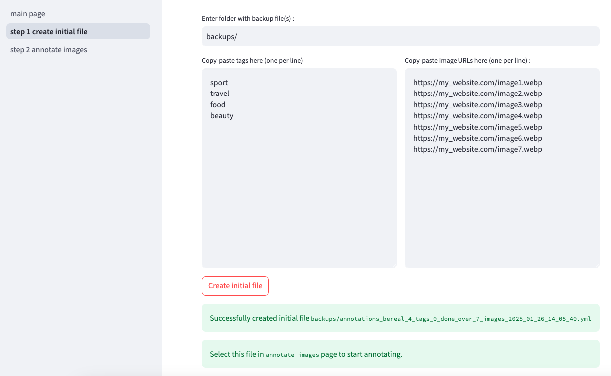
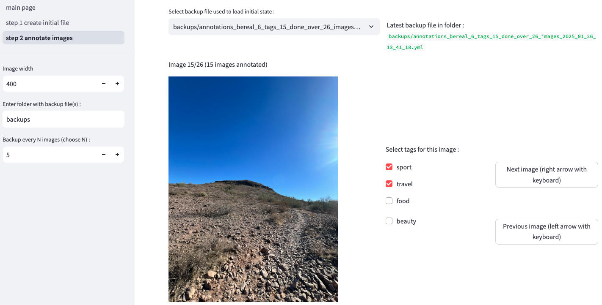

[Install Poetry](https://python-poetry.org/docs/#installation) :
```
curl -sSL https://install.python-poetry.org | python3 -
```

Add poetry binary to PATH, for MacOS do :
```
echo 'export PATH="$HOME/.local/bin:$PATH"' >> ~/.zshrc
source ~/.zshrc
```

Install dependencies with Poetry :
```
poetry install --no-root
```

Run the streamlit app :
```
poetry run python -m streamlit run main_page.py
```

Screenshot of page 1 `create initial backup file` :  


Screenshot of page 2 `annotate images` :  
